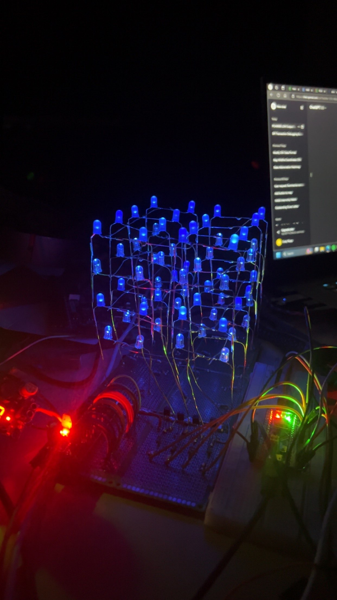
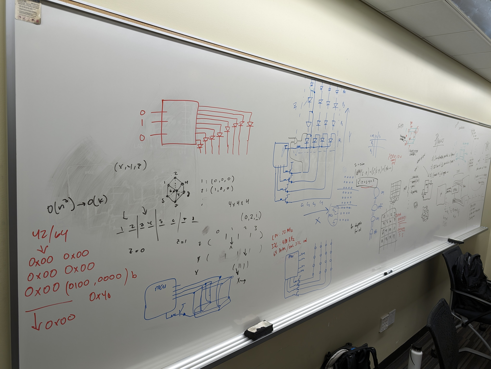

# Kickback Kube

A 3D matrix of LEDs that can simulate physics, cool animations, and much more. Designed to captivate any crowd, this platform combines interactive entertainment to make it ideal for keeping the party going past midnight.



## How to run and build

1. Run the following:
```
git clone git@github.com:Grace-Note-LLC/matrix-sim.git 
cd matrix-sim
g++ sim.cpp -o sim
```

2. Use
```
./sim -v -p 0
```
Note that `-c` is only used when `-p` is set to `0`.

```
    Usage: sudo ./sim [-v] [-c count] [-p preset] [-h help]
    Options:
      -v                        switch to verbose mode   
      -c value                  specify a value for count
      -h                        display this help message
      -p preset                 switch to a specific preset
```

## Planning

**Planning Whiteboard**



**First Prototype**


**LED Legs**


## Software

### Core Components
`sim.cpp`: This is the central executable file where the main logic and integration of the simulations are handled. It controls the interactions between different modules and manages the overall program flow, including initializing the simulation environment, processing user inputs, and updating LED states based on simulation results.

### Presets

The presets are the following:

0. **Particle Simulation** (`particle_sim.h`): Handles simple particle physics simulations, including interactions with borders.

1. **Explode Simulation** (`explode_sim.h`): Simulates expanding wavefronts and explosive effects that radiate across the cube. 

2. **Snake Simulation** (`snake_sim.h`): A playful yet intricate module where a 'snake' traverses the entire grid in a continuous path, illuminating each LED once.

3. **Flash Simulation** (`flash_sim.h`): Generates sudden bursts of light, simulating effects such as lightning or other rapid illuminations within the cube. Useful for debugging.

4. **Loading Simulation** (`loading_sim.h`): Displays loading or progress animations that fill the cube gradually.

Additional presets:

**Checkerboard Simulation**: Alternates between two LEDs to create a checkerboard pattern across the cube. This preset is particularly useful for testing the LED matrix and ensuring that all LEDs are functioning correctly.


**Side Propogator Simulation**: Simulates a wavefront propagating from one side of the cube to the other. This preset is useful for testing the speed and accuracy of the LED matrix.


### Other Modules

**SPI Communication** (`spi.h`): Manages Serial Peripheral Interface (SPI) communications, crucial for controlling the LEDs and handling data transmission between the hardware components and the simulation software.


## Firmware
Firmware is mainly involved with the STM32F103C8T6 microcontroller, which is responsible for controlling the LED matrix. The firmware is written in C and is compiled using the STM32CubeIDE. The firmware is responsible for receiving commands from the Raspberry Pi over SPI and controlling the LED matrix accordingly.


## Hardware

The Kickback Kube features a '4 x 4 x 4' 3D matrix of LEDs. The LEDs are driven by a PCA9685 servo motor driver which is controlled by an STM32F103C8T6 microcontroller over the I2C bus. The microcontroller receives commands from a Raspberry Pi 4 SBC over SPI. The Raspberry Pi 4 converts images from physics simulations, as well as other graphics, into an 8-byte message which is transferred to the microcontroller over SPI.

The LED matrix is completely soldered to 6 pieces of perf-board, and provides connections to the servo motor driver as well as the microcontroller.

For the LED matrix, each layer is controlled by a high-side BJT and current is sunk through the signal pins of the PCA9685. When one of the BJTs is turned on, it provides +5V to every LED in its corresponding layer, and the current is sunk through the PCA9685 by generating a PWM signal on one of the 16 signal pins. This allows each LED in the matrix to be individually addressable.
